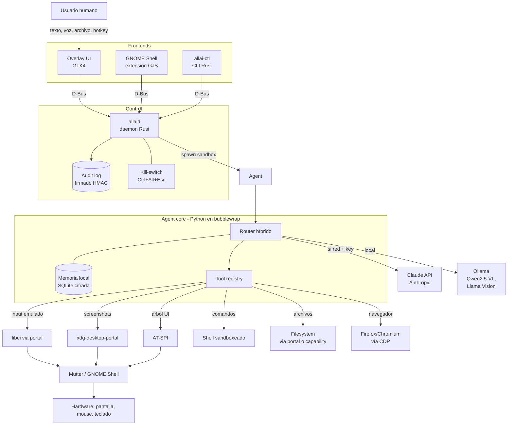
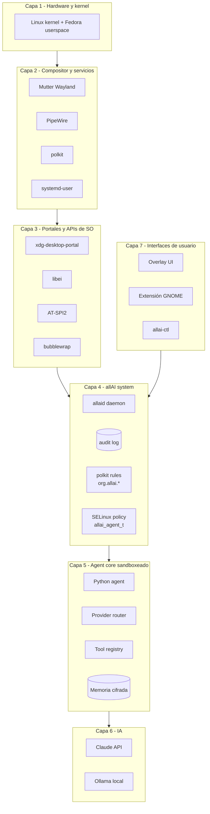
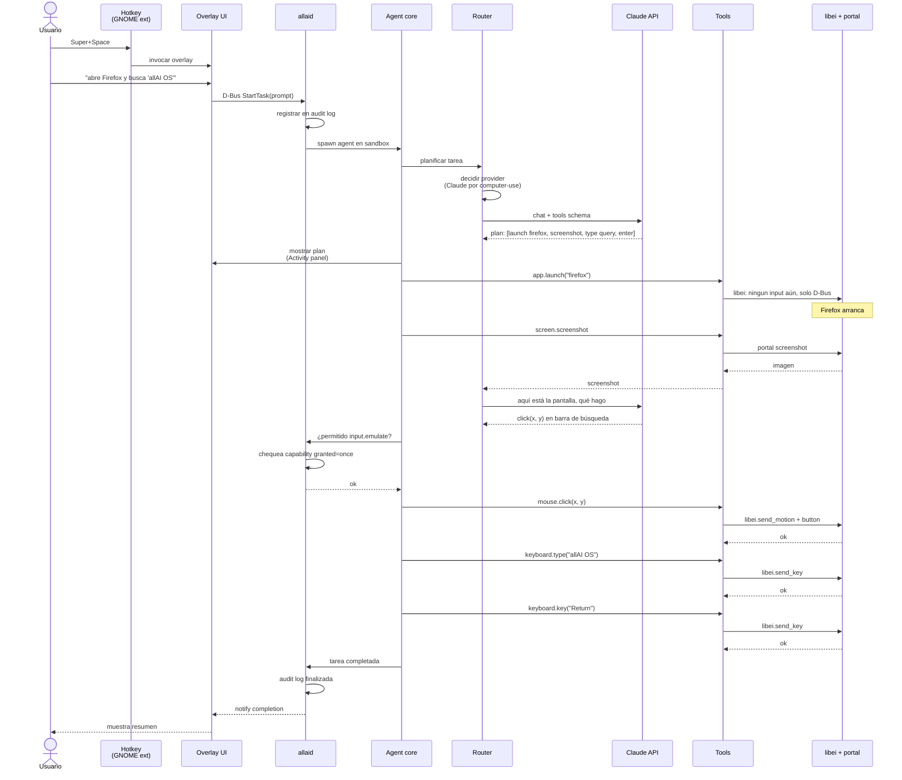
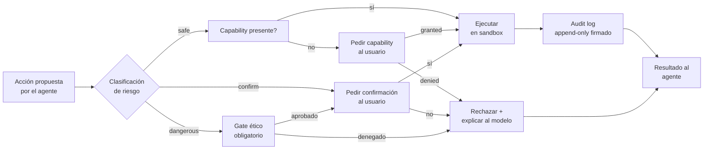

# Arquitectura de allAI OS

> Documento vivo. Las decisiones detrás de cada componente viven en los [ADRs](adr/).

## Índice

1. [Vista de 10.000 metros](#vista-de-10000-metros)
2. [Componentes](#componentes)
3. [Diagrama de capas](#diagrama-de-capas)
4. [Diagrama de secuencia: una tarea típica](#diagrama-de-secuencia-una-tarea-típica)
5. [Flujos clave paso a paso](#flujos-clave-paso-a-paso)
6. [Seguridad y permisos en el flujo](#seguridad-y-permisos-en-el-flujo)
7. [Modos de operación](#modos-de-operación)

---

## Vista de 10.000 metros

allAI OS sigue una arquitectura por capas con un único punto de control central (`allaid`) y una separación estricta entre:

- **Plano de control** (qué se decide hacer): agent core en Python, proveedores de IA, tool registry.
- **Plano de ejecución** (qué se hace en la máquina): tools sandboxeadas con bubblewrap, AT-SPI, libei, portales.
- **Plano de seguridad** (qué se permite y se audita): capability system, polkit, kill-switch, audit log firmado.

---

## Componentes

### Frontends de usuario

- **Overlay UI** (GTK4 / libadwaita): invocada por hotkey global `Super+Space`. Multimodal — acepta texto, voz, imagen pegada, archivo arrastrado. Muestra plan en vivo y estado.
- **GNOME Shell extension** (GJS): indicador en panel, registro del hotkey global, borde animado mientras la IA actúa.
- **`allai-ctl`** (CLI Rust): control programático y debug. `status`, `start`, `stop`, `logs`, `permissions`, `audit`.

### Plano de control

- **`allaid`** (daemon Rust, systemd-user): único punto de entrada. Expone D-Bus `org.allai.Agent1`. Mantiene sesiones, audit log y kill-switch. Lanza el agent core en sandbox.

### Agent core (Python, sandboxeado)

- **Router híbrido** ([ADR-001](adr/0001-lenguaje-agente-core.md)): decide qué proveedor usar según política, tarea, costo y privacidad.
- **Providers**: Claude (Anthropic SDK), Ollama (modelos locales). Interfaz común.
- **Tool registry**: cada tool con schema JSON, ejecutor, nivel de riesgo y políticas.
- **Memoria**: SQLite cifrado con SQLCipher. Embeddings locales para recuperación.

### Plano de ejecución

- **`libei` + portal RemoteDesktop** ([ADR-003](adr/0003-servidor-grafico.md)): mouse y teclado con consentimiento del compositor.
- **xdg-desktop-portal**: screenshots, archivos, cámara, micrófono.
- **AT-SPI**: árbol de UI cuando el target lo expone (más confiable que OCR).
- **Shell sandboxeado**: `bubblewrap` + filtros seccomp ([ADR-005](adr/0005-sandboxing.md)).
- **Browser via CDP**: Firefox/Chromium con flag de debug, uso de Playwright para automatización determinista.

### Plano de seguridad

- **Capability system** ([ADR-006](adr/0006-modelo-permisos.md)): permisos granulares por sesión (`once`, `always`, `never`).
- **Polkit**: para acciones que cruzan privilegios.
- **Gates por acción**: confirmación humana obligatoria para acciones irreversibles (definidas en [docs/AI_ETHICS.md](AI_ETHICS.md)).
- **Audit log**: append-only en `~/.local/share/allai/audit.jsonl`, firmado HMAC-SHA256.
- **Kill-switch**: SIGSTOP global con `Ctrl+Alt+Esc`, libera focus al usuario.

---

## Diagrama de capas

---

## Diagrama de secuencia: una tarea típica

Usuario pide "abre Firefox y busca 'allAI OS'". Camino completo:

---

## Flujos clave paso a paso

### Flujo 1: "Abre Firefox y busca 'allAI OS'"

1. Usuario presiona `Super+Space`. La extensión GNOME captura el hotkey y llama D-Bus `org.allai.Agent1.OpenOverlay`.
2. Overlay aparece, usuario tipea el prompt y presiona Enter.
3. Overlay envía `StartTask(prompt, multimodal_inputs)` a `allaid`.
4. `allaid` crea sesión, escribe entrada inicial en audit log, lanza el agent core en bubblewrap.
5. Agent core consulta al router. Router decide: tarea de computer-use → Claude API (más capaz aquí).
6. Claude responde con un plan: lanzar Firefox, esperar, tomar screenshot, identificar barra, click, escribir, Enter.
7. Agent ejecuta `app.launch("firefox")` → tool `app.launch` → `gtk-launch firefox` o D-Bus a `org.gnome.Shell`.
8. Espera que ventana esté visible (vía AT-SPI watch).
9. Tool `screen.screenshot` solicita al portal screenshot. Primer uso pide consentimiento al usuario; modo `always` lo recuerda.
10. Screenshot enviado de vuelta a Claude por el router.
11. Claude responde coordenadas de la barra de búsqueda y el plan de tipear y dar Enter.
12. Cada acción de input pasa por la capability `input:emulate`. Primer uso pide consentimiento.
13. Tool `mouse.click` y `keyboard.type` usan libei vía portal RemoteDesktop.
14. Audit log registra cada paso con timestamps y resultados.
15. Tarea completa: overlay muestra "Listo" + resumen + botón "ver audit".

### Flujo 2: "Lee este PDF y resúmemelo"

Usuario arrastra un PDF a la overlay.

1. Overlay envía `StartTask(prompt, attachments=[file://path/to.pdf])`.
2. `allaid` valida que el path está en una capability `read-fs:` activa o pide consentimiento por archivo.
3. Agent core extrae texto del PDF con `pypdf` (en sandbox, sin red).
4. Router decide: tarea de comprensión, sin computer-use, sin red estricta requerida → puede ir a **Ollama local** si hay un modelo capaz, o a Claude si el usuario prefiere.
5. Si va a Claude, el contenido del PDF se envía con prompt caching habilitado (texto largo se cachea).
6. Respuesta se muestra en overlay. Sin acciones de sistema.
7. Audit log: `pdf.read` + `provider.call(claude, tokens=...)` + `display.summary`.

### Flujo 3: "Instala el paquete `htop`"

1. Overlay → `StartTask("instala htop")`.
2. Router → Claude o local (cualquiera lo planifica).
3. Plan: `rpm-ostree install htop` o `flatpak install ...`.
4. Tool `shell.run` con cmd `rpm-ostree install htop` requiere capability `shell:any` Y polkit (cambia el sistema atómico).
5. Polkit prompt aparece: "allAI quiere instalar htop. Autoriza con tu contraseña."
6. Si aprueba, comando ejecuta. Resultado se muestra. Reboot necesario para aplicar (rpm-ostree es atómico).
7. Audit log con cada paso.

### Flujo 4: "Manda 'voy en camino' por Telegram"

Caso sensible — comunicación con terceros.

1. Plan implica: abrir Telegram desktop o web, encontrar conversación, escribir, enviar.
2. **Gate por acción**: enviar mensaje requiere confirmación humana **por mensaje**, sin importar capabilities. Excepto modo "batch autorizado para esta sesión y este destinatario" que el usuario debe activar explícitamente.
3. Si Telegram desktop no está logueado, IA no debe intentar autenticar. Pide al usuario.
4. Una vez en la conversación, IA muestra borrador en la overlay: "Voy a enviar `voy en camino` a `Mamá`. ¿Confirmar?"
5. Usuario confirma → click final. Audit log conserva el mensaje exacto enviado y a quién.

### Flujo 5: "Conecta a la VPN del trabajo"

1. Plan: invocar `nmcli` o D-Bus a NetworkManager.
2. NetworkManager pide credenciales si no están guardadas. La IA **no** las pide al usuario por chat (gate de seguridad: nunca tipear credenciales en interfaces no protegidas).
3. NetworkManager presenta su propio prompt nativo. Usuario completa.
4. IA monitoriza estado vía D-Bus `org.freedesktop.NetworkManager`.
5. Audit log: solo el hecho de la conexión, no credenciales.

### Flujo 6: Modo offline / sin clave de Claude

1. Usuario nunca configuró clave de Claude (o se quedó sin red).
2. Router detecta: no hay `claude` provider disponible.
3. Si Ollama está corriendo y hay modelo capaz instalado → usa Ollama.
4. Si no, devuelve error gentil: "Necesito un modelo configurado. ¿Quieres descargar Qwen2.5-VL? (~6GB)"
5. Si usuario acepta: tool `ollama.pull("qwen2.5vl:7b")` con barra de progreso.

---

## Seguridad y permisos en el flujo

Cada acción atraviesa este pipeline antes de ejecutarse:

Niveles de riesgo (definidos en `agent/tools/manifest.yaml`):

- **`safe`**: read-only en paths permitidos, navegación, búsqueda, screenshot, leer árbol UI. Sólo necesita capability.
- **`confirm`**: cambios reversibles en archivos del usuario, lanzar apps, escribir en clipboard, cambiar configuraciones de usuario. Capability + confirmación primera vez (o siempre según preferencia).
- **`dangerous`**: comandos destructivos, envío a terceros, transacciones financieras, cambios al sistema (rpm-ostree), git push --force, formateos. **Confirmación humana siempre, sin excepción.** Las reglas absolutas de [docs/AI_ETHICS.md](AI_ETHICS.md) las hacen no-bypaseables.

---

## Modos de operación

allAI OS soporta varios modos que ajustan el comportamiento global:

| Modo | Comportamiento |
|------|----------------|
| **Trust** | Acciones `safe` y `confirm` corren sin preguntar tras primera autorización. `dangerous` siempre pregunta. |
| **Always ask** | Cada acción no `safe` pide confirmación. Default para nuevos usuarios. |
| **Paranoid** | Cada acción, incluso `safe`, pide confirmación. Para auditoría o tareas críticas. |
| **Demo / Dry-run** | La IA narra lo que haría, no ejecuta. Útil para enseñar o evaluar planes. |
| **Offline** | Sólo proveedores locales (Ollama). Sin red. |
| **Privacy** | Forzar provider local para datos detectados como sensibles (PII, credenciales en pantalla, etc.). |

El modo se cambia en Configuración o por sesión con `allai-ctl mode <name>`.

---

## Decisiones de diseño relevantes

Cada componente y mecanismo tiene un ADR que justifica su elección:

- [ADR-001](adr/0001-lenguaje-agente-core.md) — Python + Rust
- [ADR-002](adr/0002-base-distro.md) — Fedora Silverblue + imagen OCI
- [ADR-003](adr/0003-servidor-grafico.md) — Wayland + libei + AT-SPI
- [ADR-004](adr/0004-ipc.md) — D-Bus
- [ADR-005](adr/0005-sandboxing.md) — bubblewrap + SELinux + seccomp
- [ADR-006](adr/0006-modelo-permisos.md) — capability system + polkit + gates + audit
- [ADR-007](adr/0007-tooling-empaquetado.md) — RPM + COPR + ghcr.io + cosign
- [ADR-008](adr/0008-telemetria.md) — opt-in estricto y autohospedada

---

## Pendiente en este documento

- Diagrama detallado de la memoria del agente (estructura de embeddings, ciclo de vida de información personal).
- Diagrama del flujo de updates (rpm-ostree pull → stage → reboot).
- Detalles del threat model (irá a `docs/threat-model.md` cuando se trabaje).

---

Última actualización: 2026-04-28
